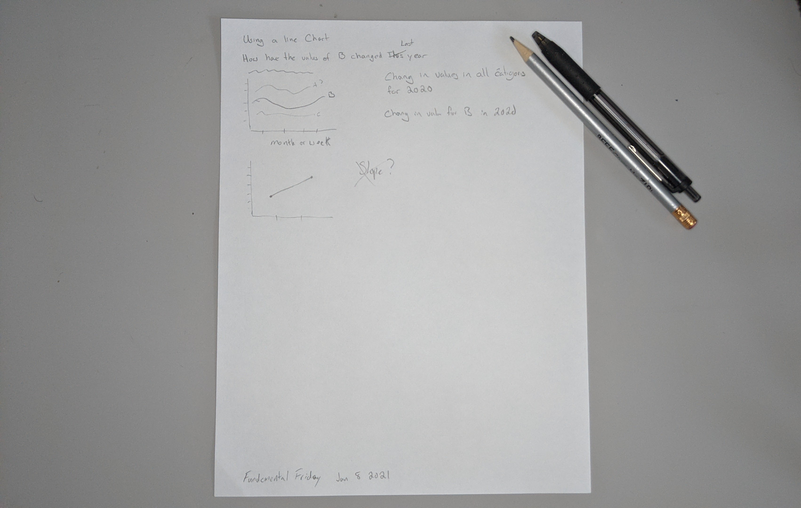
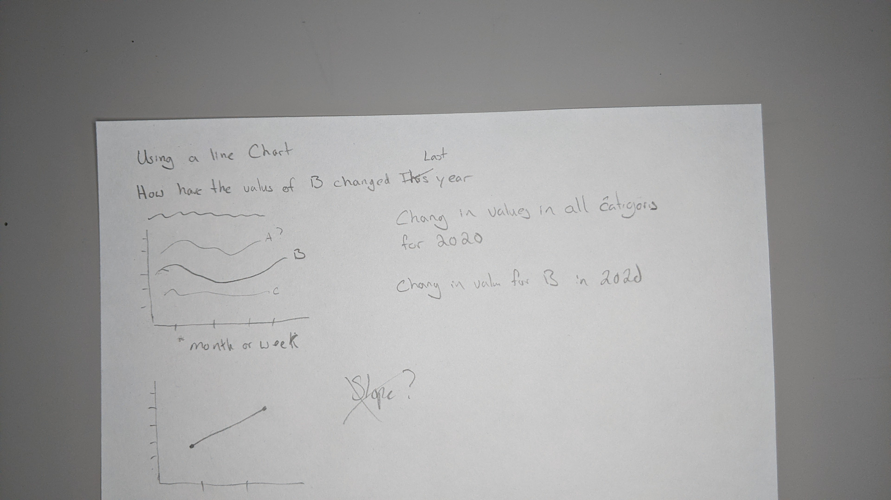
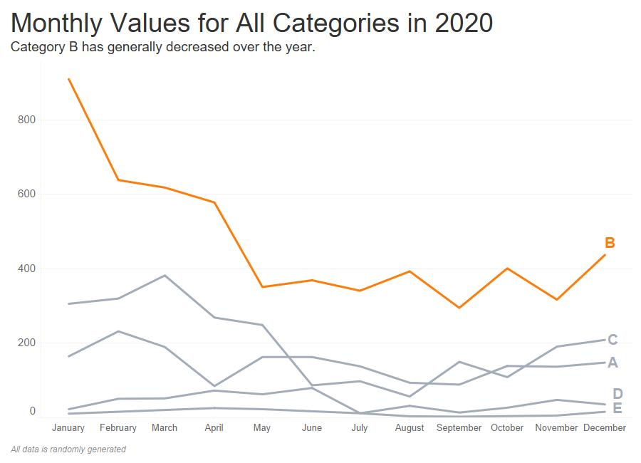

# Fundamental Friday #2 

## The Question
This weeks task was to design a line chart that answers the following question:

> How have the values of B changed last year

## The Design

I started with a simple design on paper.  I did not explore a lot of designs but my first thought was to not only show the values for B but include the values of other categories for context.  At the time I was also thinking of aggregating the numbers on the month because I was going to be covering an entire year and I did not think that a lower granularity would add any greater context.

I did think about doing a slope chart of just B and I drew that out, but decided to stick with the regular line chart.  I felt that sticking with the more fundamental line chart was more inline with the intention of my little project (FundamentalFriday).  During the design step I also drafted out a few titles that I would work for the chart.  I did not use any of them, but it got my mind working on the idea.

## The Process

This week I decided to build the design in Tableau. I liked working on paper last week, but my handwriting is not good and I need to work on it so that it is less distracting to the final design.

I started by loading in the data, I was able to use the detailed version of my practice data because I could rely on Tableau to aggregate it for me.  After loading the data I filtered the data to only the 2020 year.  I then added the vales and the dates to the chart.  I looked at date aggregations other than month, but decided to stick with my first choice, days and weeks were too *noisy* and made it hard to see how the numbers changed over the year.  With the overall structure settled on I moved on to the style elements of the chart.

Even though I wanted all of the categories on the chart I did not want them to pull attention away from the original question, which was about category B.  I achieved that I made B a bright color while I made all other categories the same gray color.  With good labeling I could get away with this but only barely given the nature of the data (more on that latter).  Speaking of labels, I added the category name to the end of each line and set the label color to match the rest of the line.  This seems like a simple thing but it really helps to reinforce to the viewer that the label belongs to the line.  It loses a little with many of the lines being the same color.

I adjusted the date labels to read as the full month name.  Whenever I can use the full month name, despite what some professions tend to do (I am looking at you Finance and Accounting) generally people do not think of months in terms of abbreviations.  They are there if needed, but I only use them if I don't have the space for the full name.  I also adjusted the frequency of the horizontal grid lines, or tick marks, so they felt helpful but not overloading the viewer with information that was not helping.  I also adjusted the color and weight of the lines and labels so they stood out just enough without drawing the viewer away from the lines on the chart. 

You may notice that I did not add axis labels to the chart, but if I did my design well you may not have noticed. ;) This was intentional because I was planning on adding that information to the title of the chart.  So while the information was not next to the axis it was still going to be a part of the chart.  This is why a good title can help so much, it lets you have more control of where the information can live on the chart.  I also added a subtitle to the chart.  I wanted to add more direction for the viewer in interpreting the chart.  This could have been done with a trend line on the category in question, but I felt that words would provide a more clear understanding to a broader audience. 

I also changed the font to be Arial. Nothing fancy, but also not the defaults.

## What I Learned

This week I learned that clarity and focus of the information is important.  Although the lines of all the categories are there, they can be confusing because they overlap, sometimes this is called a spaghetti chart for that reason. I just barely got away with it on this chart because there are so few lines, one more line or if the lines overlap any more and I would have felt I needed to change the design.  Maybe something as simple as different values of gray instead of all the same.  I want to pay more attention to that in the future and make sure it is as clear as possible to as many people as possible.

Thank you for coming along this journey with me and I hope that you were able to learn something from my process.
