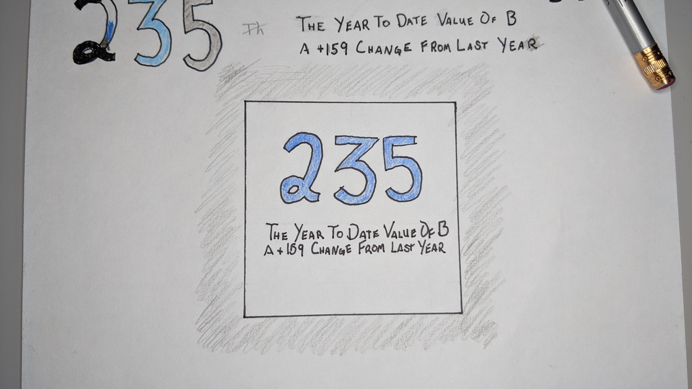

# Fundamental Friday #3 

## The Question
This week I tasked myself with making a Big Number (chart?) that answers the following question:

> What is the total value of B, year to date.

## The Design

I once again started off with a design on paper. (I feel that starting on paper helps me keep to the bounds of the design later in the process.)  There are not a lot of design options when dealing with Big Numbers but I still sketched out what I wanted it to look like. I wanted the number to be in the top half of the chart area with the supporting text/description underneath it.  I did take the time to write out a couple of descriptions to get the ideas going.  

## The Process

The big effort for this week was that I wanted to try it on paper again and try out an engineers trick for the typography: small capitals.  I learned in my previous hand drawn chart that my bad handwriting can distract from the chart so I wanted to try and improve that.  I also got a better pen to go over my pencil lines, one that was not going to smear when I tried to erase the pencil.

I practiced my letters and made block numbers.  Going slow helped make them look better and the pen provides better contrast then may last effort.  I definitely think it is an improvement but there is still more practicing to do.

I also wanted to go for precision so I busted out the ruler and started measuring out the design space.  I started with defining the chart area and the inner padding of that area.  Next came the space for the number, I knew it was just three characters so I divided my space into thirds to attempt to get an even spacing.  I also added lines for the description and tried to keep everything centered.  I think that I could have given myself more space between the lines of text in the description but I think it worked well.

As I was practicing writing out the description I decided that I needed to include more context for the number.  Without other supporting text the Big Number can leave the viewer listless, let's face it Big Numbers do not bring a lot to the party.  So I decided to compare the value to the same time last year.  I find this to be a common question and put the number in the form of a delta, or the difference from the previous value.

Next came color.  I was not sure if this would end up just black and white or not but decided to go with color to be more attention grabbing for the viewer.  Once I was done filling in the block numbers with color it still felt like it needed more contrast. I thought about filling the cart area with a light gray but it just made the text look smeared (something I did not want). So I added the contrast into the margin around the chart area.  This separated the chart from the surrounding page in a way that made it easier to read.

## What I Learned

This week I learned that numbers are hard to draw. ;) Really the two things that stuck out to me were the impact that the color had, both the numbers and the margin, and the value of context.  I do not advocate filling white space just because it is there but the separation that the darker margin made a big improvement.  And the additional context in the description made it so you can stop and think about the number and not just gloss over it.  I think that giving the viewer the option is important and will have an impact on how well the number is remembered.

Thanks for reading and I hope that you were able to learn something along with me.
