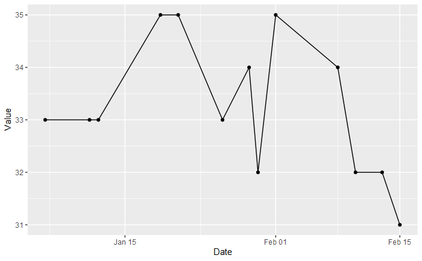

# Fundamental Friday #9

## The Question

This week I tasked myself to create a line chart that answers the question:

> How have the value of C changed year to date

## The Design

I had good success with an exploratory design style last week so I tried it again this week.  I am not sure I had as good of success this time however.  I think I relied on the *discovery* part of the design process too much and it left me without any real satisfaction with what I made this week.  I will go through the process and maybe I can convey my thoughts. 

## The Process

I decided to use R for my tool this week.  It has been many years since I last used R in any meaningful way and I have to admit that I felt a little lost.  But I made it through.

I started with loading the data.

```R
head(raw_data)
```
 
| | ID | Date | Category | Value |
|- | -- | ---- | -------- | ----- |
|1	|1	|2019-02-24	|C	|61|
|2	|2	|2019-02-25	|C	|62|
|3	|3	|2019-02-26	|E	|46|
|4	|4	|2019-02-27	|C	|59|
|5	|5	|2019-02-28	|C	|62|
|6	|6	|2019-03-01	|D	|32|

----

It did need to be filtered down as I was only interested in one category and the year to date time range.

```R
filtered_data <- filter(raw_data, Category == "C" & Date >= as.Date("2021-01-01") & Date <= as.Date("2021-02-28"))
head(filtered_data)
```
 
 
| |ID |Date |Category |Value |
|-|-|-|-|-|
|1|	683	|2021-01-06	|C	|33|
|2	|688	|2021-01-11	|C	|33
|3	|689	|2021-01-12	|C	|33
|4	|696	|2021-01-19	|C	|35
|5	|698	|2021-01-21	|C	|35
|6	|703	|2021-01-26	|C	|33

---

Then it was staring to a line chart.
```R
ggplot(data = filtered_data,aes(x=Date, y=Value)) + geom_line()+ geom_point()
```


Then the real work began.  I adjusted the line color and points, I left the code in for myself and not as a best practice.  I also used a built in theme for the chart background and grid lines.  I really just cycled through the themes until I found one that I liked, this was part of the ‘too much discovery’ that I was referring to earlier, I just randomly tried things without any direction.

```R
plot <- ggplot(data = filtered_data,aes(x=Date, y=Value)) 
plot <- plot + geom_line(size=1.1,color="#2a2a2a")
plot <- plot + geom_point(size=0)
plot <- plot + theme_minimal()
```

The next part I did was to expand the y axis and adjust the grid lines so that the axis would include 0 and have some padding above the chart.  This pushed the y axis up to the next major grid line and I felt the padding helped put the line in better context.

```R
plot <- plot + expand_limits(y = 5)
plot <- plot + scale_y_continuous(expand = c(0, 5),breaks = seq(0, 100, 20),minor_breaks = seq(0 , 100, 10))
```

After that was adding and styling the chart and axis titles.  I had not really thought of any Chart titles before so I actually not sure what to go with at this point. But the defaults did not put enough space between the title and the chart body so I had to add some space there.  I dropped the x axis title, with the year in the title and the axis label clearly making them dates adding a ‘Date’ title felt superfluous. For the y axis I rotated the label and lighted the text so that it was both easter to read and lower in the visual hierarchy.

```R
plot <- plot + ggtitle("The Values of Category C for 2021") + xlab("") + ylab("Values")
plot <- plot + theme(plot.title = element_text(color="#515151", size=24, face="bold", margin=margin(0,0,20,0)))
plot <- plot + theme(axis.title.x = element_text(color="blue", size=14, face="bold"))
plot <- plot + theme(axis.title.y = element_text(color="gray", size=10, face="bold",angle = 0))
```

And here is all of the code together that produced the final chart.

```R
plot <- ggplot(data = filtered_data,aes(x=Date, y=Value)) 
plot <- plot + geom_line(size=1.1,color="#2a2a2a")
plot <- plot + geom_point(size=0)
plot <- plot + theme_minimal()
plot <- plot + expand_limits(y = 5)
plot <- plot + scale_y_continuous(expand = c(0, 5),breaks = seq(0, 100, 20),minor_breaks = seq(0 , 100, 10))
plot <- plot + ggtitle("The Values of Category C for 2021") + xlab("") + ylab("Values")
plot <- plot + theme(plot.title = element_text(color="#515151", size=24, face="bold", margin=margin(0,0,20,0)))
plot <- plot + theme(axis.title.x = element_text(color="blue", size=14, face="bold"))
plot <- plot + theme(axis.title.y = element_text(color="gray", size=10, face="bold",angle = 0))
plot
```


## What I Learned

This week I learned that there are steps of the design process that really help me.  Going straight into making the chart from the exploratory analysis phase does not help me make a good chart.  I do better when I think about what I want to make and how I want the viewer to interact with the chart.  Next week I think I am going to try a hybrid of the two approaches.

Thank you for reading and I hope that you learned something this week.
